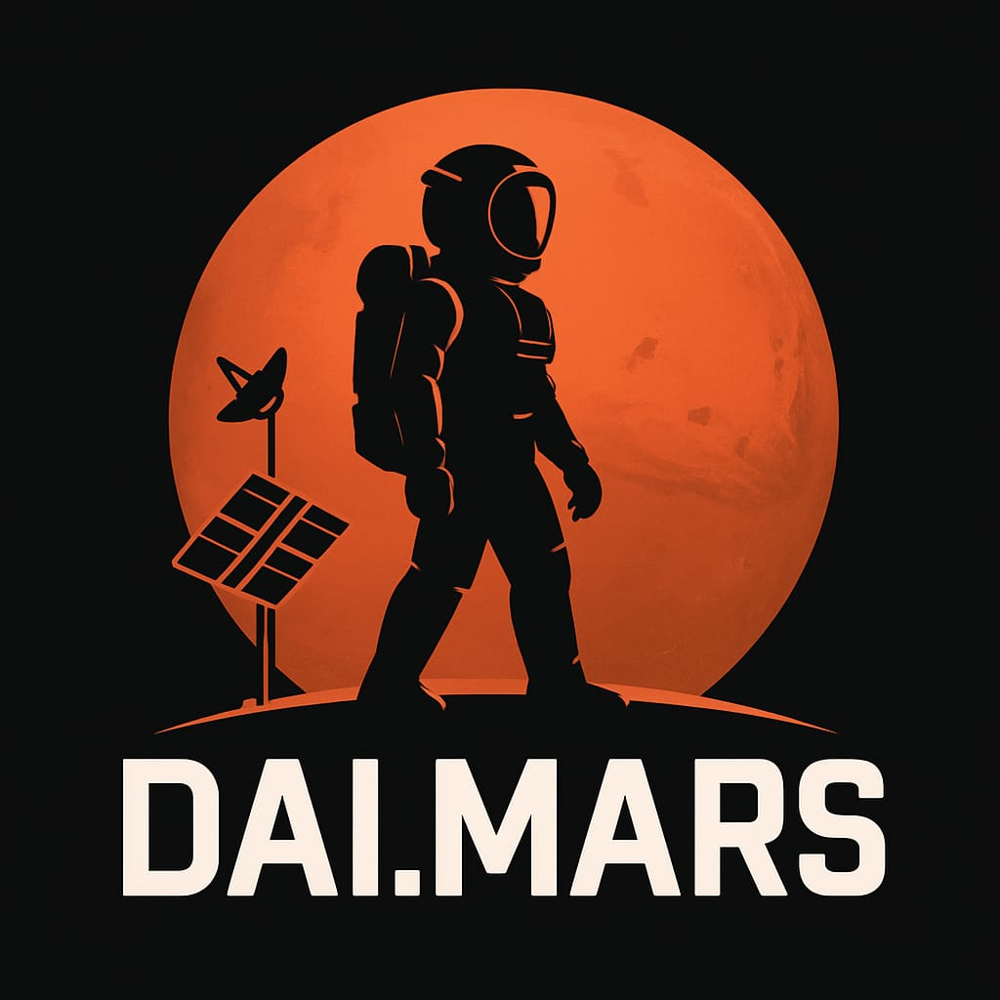

# dai.mars v0.1



## Oyun Hakkında

2030 yılında Mars'a yapılan ilk insanlı görevde, dönüş aracının kalkış sırasında hasar görmesi sonucu Mars yüzeyinde mahsur kaldın. Hayatta kalma mücadelesi verirken bir yandan da Dünya ile iletişim kurmaya çalışacaksınız.

## Dosya Yapısı ve İşlevleri

| Dosya | Açıklama |
|-------|----------|
| `main.py` | Oyunun ana başlatıcı dosyası |
| `game.py` | Temel oyun döngüsü ve ana menü yönetimi |
| `resources.py` | Su, gıda ve enerji yönetimi |
| `locations.py` | Harita navigasyonu ve mekan etkileşimleri |
| `communication.py` | İletişim sistemi mekanikleri |
| `utilities.py` | Yardımcı fonksiyonlar ve arayüz öğeleri |
| `story.py` | Hikaye girişi ve diyaloglar |

## Nasıl Oynanır?

### Temel Kontroller
- **1-5** numaralı seçeneklerle menülerde gezinebilirsiniz
- **Enter** tuşu ile seçimlerinizi onaylayabilirsiniz
- **0** her zaman menüden çıkış/geri dönüş seçeneğidir

### Kaynak Yönetimi
- **Su**: Her hareketle azalır, içerek enerji kazanabilirsiniz
- **Gıda**: Temel besin kaynağı, enerji sağlar
- **Patates**: Sera alanında yetiştirilebilir alternatif besin
- **Enerji**: Tüm eylemler enerji tüketir, düşükse ölürsünüz

### Oyunun Kazanılması

Oyunu kazanmak için şu adımları izlemelisiniz:

1. **Kaza Alanı**'nda anten parçasını bul (Bölgeyi incele)
2. **İletişim Merkezi**'ne git
3. Anten parçasını iletişim sistemine tak
4. Manuel frekans ayarı yaparak Dünya'ya sinyal gönder
5. Bağlantı kurulduğunda kurtarılmayı bekle!

## Sistem Gereksinimleri

- Python 3.6 veya üzeri
- Renkli terminal desteği (Windows'da `colorama` önerilir)

## Kurulum

1. Depoyu klonlayın:
```bash
cd mars_gorevi
```

2. Gerekirse bağımlılıkları yükleyin:
```bash
pip install colorama
```

3. Oyunu başlatın:
```bash
python main.py
```

## Oyun Sonları

- **Başarılı Son**: Dünya ile iletişim kurup kurtarılmayı beklemek
- **Başarısız Sonlar**:
  - Enerjinin bitmesi
  - Suyun tükenmesi
  - Zamanında iletişim kuramamak

## Lisans

Bu proje MIT lisansı altında lisanslanmıştır - detaylar için `LICENSE` dosyasına bakın.

---

**Not**: Bu README dosyası oyunun temel yapısını anlatmaktadır. Oyun içi deneyim için lütfen `main.py` dosyasını çalıştırın ve Mars'ta hayatta kalmaya çalışın!

## 📜 Lisans

Bu proje MIT Lisansı ile lisanslanmıştır - detaylar için [LICENSE](LICENSE) dosyasına bakın.

[](https://opensource.org/licenses/MIT)